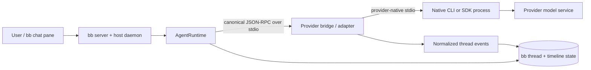
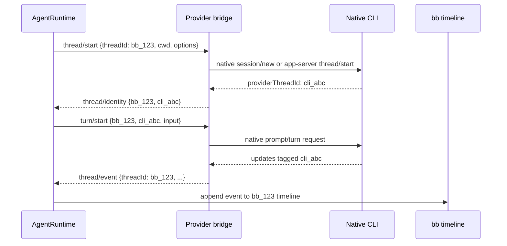
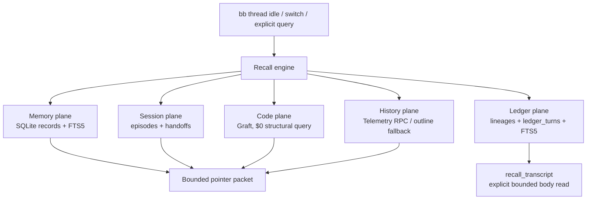
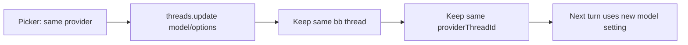
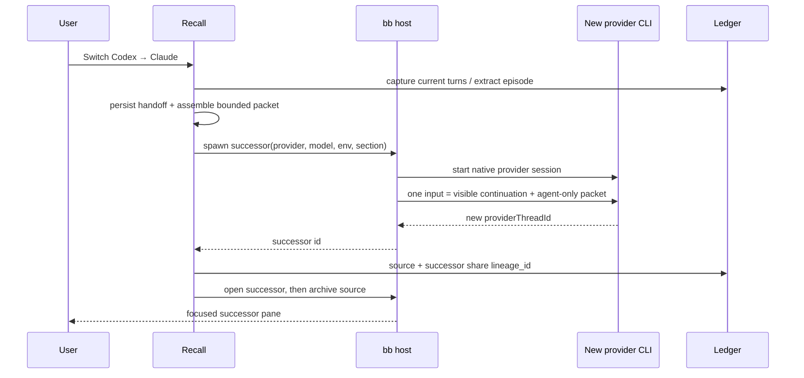
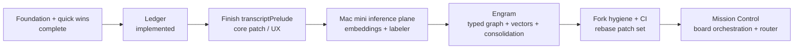

# Universal Memory and CLI-Scoped Model Switching in bb

**Status:** architecture and implementation record  
**Date:** 2026-08-18  
**Scope:** bb core, native provider CLIs/bridges, `bb-plugin-recall` Ledger, model switching, and the planned fork surface

## Executive summary

The goal is to make model choice a replaceable compute decision while keeping
session state durable, inspectable, and scoped to the correct CLI/provider.

The governing rule is:

> **bb owns state; a provider CLI owns its live model session.**

bb does not pretend that Claude, Codex, Grok, Cursor, or another agent expose
the same native session format. Instead, bb gives every provider a canonical
runtime boundary and records the durable state outside the provider process:

- a bb thread is the stable user-facing handle;
- a provider thread/session is the native CLI identity attached to that bb thread;
- Recall stores durable memory, structured episodes, handoffs, and the append-only
  cross-provider Ledger;
- a provider switch creates a new native session when the provider changes;
- the successor receives a bounded handoff packet and the same lineage id;
- project/environment/thread filters prevent state from leaking across workspaces.

The result is universal memory without universalizing the provider protocol.

## 1. What bb is communicating with

### 1.1 The native CLI is a supervised local process

The normal path is not “bb calls a hosted model API directly.” The host daemon
starts a provider-owned command on the selected machine and workspace. The
command may be:

| Provider shape | What bb starts | Example | Where provider semantics live |
| --- | --- | --- | --- |
| Native protocol server | The provider CLI's long-running JSON-RPC server | `codex app-server` | `plugins/provider-codex/src/bridge/` |
| ACP CLI | A generic bb bridge, which starts the configured ACP executable and speaks ACP over its stdio | `cursor-agent acp` | `plugins/provider-acp/src/bridge/` |
| SDK-backed provider | A Node bridge that hosts the provider SDK | Claude Agent SDK | `plugins/provider-claude-code/src/bridge/` |

All three are “native” in the important sense: the provider's own CLI/SDK,
authentication, session semantics, model ids, permission rules, and event
vocabulary remain authoritative. bb supplies a stable outer protocol so the
rest of the product does not need a provider-specific branch for every turn.

### 1.2 Process and wire topology



The runtime process manager (`packages/agent-runtime/src/runtime-provider-process.ts`)
uses `spawnPortablePipedProcess` with an explicit command, argument vector,
working directory, and sanitized environment. stdin/stdout are pipes; stderr is
kept as a bounded diagnostic tail. JSON-RPC is newline framed and read with a
bounded-line reader so a malformed or unbounded provider line cannot consume
the daemon.

The runtime sends canonical commands such as:

```text
initialize
model/list
thread/start | thread/resume | thread/fork
turn/start | turn/steer
thread/stop | thread/archive | thread/unarchive
```

The bridge translates these commands into the provider dialect and translates
provider notifications back into normalized `ThreadEvent` values. The runtime
does not interpret provider-specific wire payloads; the adapter owns that
translation (`packages/agent-runtime/src/provider-adapter.ts`).

### 1.3 How provider identity stays scoped

Every live provider process has an identity registry. A bb `threadId` is mapped
to the provider's native `providerThreadId`; incoming events are stamped with
the bb thread id before they enter the timeline.



`RuntimeThreadIdentityRegistry` rejects an event that names another live bb
thread. It only uses the “single thread in this process” fallback when the
bridge supplies no usable id and the process cannot be confused with another
thread. This is the principal isolation guarantee for concurrent sessions.

### 1.4 Provider-specific examples

**Codex.** The Codex bridge supervises one `codex app-server` child per bb
thread, plus short-lived maintenance children for model listing and operations
that do not need a live child. It maps `thread/stop` with an active turn to
`turn/interrupt`; an idle release kills the child without fabricating an
interrupted turn. Codex ids are translated to bridge-minted event ids, while
the native turn id is retained as a provider checkpoint where supported.

**ACP.** The ACP bridge starts the configured executable with `spawn`, then
speaks ACP JSON-RPC over that child's stdin/stdout. A bb thread owns one ACP
session. `session/new`, optional `session/load`, `session/fork`,
`session/prompt`, `session/cancel`, and `session/update` are kept inside the
bridge. Model discovery either runs a provider model-list command with
`execFile` or creates a throwaway ACP session and inspects its config options.

**Claude Code.** The bridge hosts the Claude Agent SDK and exposes the same
canonical bridge surface. It is still provider-session scoped, but the native
boundary is an SDK session rather than a standalone CLI subprocess.

## 2. Session scoping contract

There are four distinct scopes. They must not be collapsed into one “memory”
bucket:

| Scope | Owner/key | Intended contents | Cross-provider behavior |
| --- | --- | --- | --- |
| Native provider session | provider CLI + `providerThreadId` | Live context, tool state, native compaction, auth | Never merged across providers |
| bb thread | `threadId` | User-visible timeline, provider binding, environment, execution options | Stable handle until a provider switch creates a successor |
| Session lineage | root `lineageId` | The append-only Ledger for one switch chain | Shared by source and successor threads |
| Project memory | `project_id` in Recall | Durable decisions, facts, gotchas, procedures, references | Available to any provider in that project |

The CLI itself remains scoped to the selected bb thread and environment. The
`bb` CLI commands (`bb recall`, `bb tasks`, `bb thread`, `bb provider`) call the
bb server SDK; they do not bypass the server to mutate another provider's
process. A provider can read shared state through tools/CLI, but it cannot
silently become the owner of another thread's native session.

Project isolation is query-side because one plugin SQLite database contains
multiple projects. Every project-scoped query must include `project_id`; a
missing project id matches nothing, not everything.

## 3. Universal memory architecture

### 3.1 Recall planes

Recall is the provider-independent memory plane. It is pointer-first: the
standing catalog contains compact records, and bodies/transcripts are fetched
only when needed.



The current Recall schema (`bb-plugin-recall/src/schema.ts`) contains:

- versioned `records` plus `record_history`, with `global`, `project`, and
  `thread` scope checks;
- `thread_state`, including provider/model, goal, next action, source and
  successor thread ids, and `lineage_id`;
- append-only `lineages` and `ledger_turns`, with `messages_json`, provider/model
  provenance, completion status, and `exceeded_preview_bound`;
- FTS5 triggers for records and Ledger turns;
- typed graph edges and an embeddings table for the Engram work.

Ledger capture is idempotent by `turn_id`. It pages the host timeline from the
oldest page (bounded at 50 pages), resolves the successor into the source
lineage, and renumbers `seq` from `ROW_NUMBER()` when an out-of-order turn
arrives. `turn_id`, not `seq`, is the stable identity.

### 3.2 Pointer packet versus transcript body

`assemblePacket()` produces a bounded `HandoffPacket` containing the source and
target provider/model, goal, next action, clipped last response, selected
decision/fact/episode pointers, files, Graft availability, telemetry
availability, and expansion commands. The packet is deliberately not a full
transcript.

The one intentional exception is `recall_transcript`:

- `grep`: up to 3,000 characters and short snippets, used to locate turns;
- `range`/`tail`: up to 6,000 characters of verbatim messages;
- lineage is the default scope; project-wide search is explicit.

This preserves auditability without turning every model switch into a massive
prompt injection or a provider-specific transcript replay.

## 4. Model switching: implementation and flow

### 4.1 Same-provider model change: in place

When the provider id is unchanged, `RecallEngine.switchSession()` calls the
host `threads.update({ model, reasoningLevel })`, updates `thread_state`, and
returns `mode: "in-place"`. The existing provider session and full native
context survive. No handoff message is delivered because a synthetic “context
packet” turn would be noise and could alter the model's task.



Provider execution settings are classified as live or session-scoped by the
adapter. Instructions are frozen for a live provider session; changing memory
catalog or plugin instructions does not forcibly resume a session and kill
provider-owned background work.

### 4.2 Cross-provider change: successor thread in one atomic input

When the provider id changes, the host cannot mutate `providerId` on the
existing thread. Recall therefore:

1. extracts the current episode and persists a deduplicated handoff record;
2. builds a packet from pointers plus the clipped last response;
3. creates a visible continuation prompt and an agent-only packet;
4. spawns a successor with explicit provider/model/options and the same
   environment/section where possible;
5. joins the successor to the source `lineage_id`;
6. opens the successor pane first, then archives the source;
7. repoints in-flight Board reviews best-effort so findings return to the active
   thread.

The visible prompt and agent-only packet are sent as one structured `input`.
This prevents a race in which a provider starts answering the visible prompt
before its handoff context arrives. `sourceThreadId` is intentionally not sent
to the host spawn call: ACP Grok and some other providers reject host-level
provider forks with HTTP 400. The universal continuity is supplied by Recall,
not by pretending that native provider fork semantics are portable.



### 4.3 Transcript visibility inside the native pane

The Ledger already contains the complete cross-provider record, but the
packaged core chat pane cannot place plugin-owned rows above native messages.
The planned/forked `transcriptPrelude` slot adds that last-mile UX: Recall
returns a small source-provider/turn-count summary and the pane renders prior
session rows above the native timeline, collapsed by default.

This is a core patch, not a plugin-only feature. It is tracked as BBP-63 and
implemented as patch `bb-fork/patches/0005-Add-a-transcriptPrelude-plugin-slot-above-the-native.patch`.

## 5. What has changed and what is planned

### Shipped foundations

- Recall replaced competing builtin-memory injection with one provider-neutral
  memory plane; durable kinds are injected, while episodes and handoffs remain
  searchable session artifacts.
- Same-provider switching is silent and in place.
- Cross-provider switching is successor-based, packet-only, and archives the
  source after focusing the successor.
- Handoff packets include the previous model's clipped last response and
  explicit Graft/telemetry expansion hints.
- Phase 2 Ledger is implemented: append-only turns, lineages, FTS5, idempotent
  capture, project/lineage transcript search, and bounded verbatim reads.
- Dispatch uses provider-specific hidden worker threads, validates model
  selection against the provider catalog, reuses the parent environment, and
  enforces ownership before status/stop operations.
- Review & Return keeps Board as the durable review owner and repoints active
  reviews across a provider switch.

### Planned sequence



1. **Finish the native transcript surface (Phase 5.3).** Verify the forked
   build renders the Ledger prelude, preserves pane tabs, and remains usable
   through `bb connect`.
2. **Stabilize fork hygiene (Phase 5.2).** Keep one patch per core diff,
   disable/repoint official auto-update for fork builds, replay patches onto
   upstream tags, and run CI on each upstream release.
3. **Add the Mac mini inference plane (Phase 3).** Host resident embeddings and
   on-demand labeling behind a settings-driven OpenAI-compatible endpoint.
   Current measured decision: reranking was dropped after roughly 18 seconds
   for 20 candidates; use RRF instead. Cloud `text-embedding-3-small` remains
   the configured plane with a local mini fallback.
4. **Complete Engram (Phase 4).** Operationalize typed graph edges,
   project-safe vector retrieval, Graft `about-code` links, nightly
   consolidation, lab notebook, and standup digest. The schema primitives are
   present; the end-to-end metabolism is not complete.
5. **Build Mission Control (Phase 6).** Use Board tasks as the orchestration
   surface, dispatch models against task cards, train a classical router from
   TurnStats, prefetch likely context, and track cost/belief supersession.

## 6. Limitations and known blockers

### Provider and session limitations

- A host thread has one provider id. A provider change therefore requires a
  successor thread; there is no portable in-place cross-provider mutation.
- Native capabilities differ. ACP `fork` is tip-only, checkpoint forks are
  rejected, `session/load` is optional, and some providers do not support
  archive/rename. The packet is the portable contract; native history is not.
- A provider may fail to resume a native session. ACP falls back to a fresh
  session and emits a warning; the Ledger remains available, but native
  in-agent history is not restored.
- Model discovery can time out, require auth, or return no models. Bridges
  degrade to a synthetic default entry rather than blocking the picker, which
  means a requested model may still fail at session construction.
- Provider executables and SDKs are machine-local dependencies. Missing PATH
  entries, CLI version drift, auth state, or provider protocol changes are
  runtime blockers outside Recall's database.

### Ledger and memory limitations

- History before Ledger capture existed is not backfilled yet; backfill would
  interact with sequence renumbering and needs its own migration/reconciliation
  phase.
- Timeline capture is bounded at 50 pages. Older turns are explicitly omitted
  and must be reported, not silently treated as complete.
- `seq` can change after out-of-order capture. Consumers must use `turn_id` for
  stable identity.
- Telemetry previews can be lossy; `exceeded_preview_bound` records that fact.
  The full `messages_json` path is the audit source when available.
- Pointer packets are intentionally incomplete. They require the successor to
  call Recall/Graft/transcript tools for details; a provider that ignores tools
  will not receive the full prior conversation.
- One SQLite database serves multiple projects. A missing or incorrect
  `project_id` filter is a data-isolation defect, not a harmless empty search.
- Embeddings are stored as JSON with cosine scan in the current working path;
  this is acceptable under roughly 100k rows but is not a substitute for a
  production vector index at larger scale.

### Core/fork and operational blockers

- Plugins cannot currently insert arbitrary rows into the native chat timeline;
  the transcript-prelude slot requires a bb core patch and an upstream-drift
  strategy.
- The fork must prove that a dev build can enroll in bb Connect and expose a
  port. The go/no-go spike is complete, but the fork must use a copied data dir
  and separate ports; never point it at live `~/.bb`.
- Packaged bb auto-updates from the official feed. Fork builds need the update
  kill switch and CI patch replay or upstream releases can erase the surface.
- Provider switch and review delivery are coupled. If a hidden/archived thread
  is not restored/listed before send/open, the user can receive a successful
  delivery into a thread that disappears from the sidebar. Archive, never
  `visibility: hidden`, for user-conversed source threads.
- Board review repointing is best-effort. A switch must succeed even if Board
  is not installed; the durable run then needs visible recovery if its return
  target cannot be updated.

## 7. Acceptance criteria for the target state

The design is complete when all of the following are true:

1. A bb thread can run on a native provider CLI with a deterministic mapping
   between `threadId` and `providerThreadId`.
2. Same-provider model changes preserve the native session and do not create a
   synthetic handoff turn.
3. Cross-provider changes produce exactly one successor, one shared Ledger
   lineage, one bounded agent-only packet, and an auditable source disposition.
4. The user can see the prior-session record in the native pane without a full
   transcript injection.
5. Recall, Graft, telemetry, tasks, and Board all filter by project/thread
   scope and fail closed when scope is absent.
6. Provider failure, missing model discovery, stale bridge output, review
   delivery failure, and fork/upstream drift are visible and recoverable rather
   than silently corrupting the session record.

## Evidence map

The implementation details above are grounded in these repository surfaces:

- `bb/packages/agent-runtime/src/runtime-provider-process.ts` — child process,
  stdio, bounded framing, exit handling;
- `bb/packages/agent-runtime/src/provider-adapter.ts` and
  `src/provider-bridge-protocol/` — canonical command/event contract;
- `bb/packages/agent-runtime/src/runtime-thread-identity.ts` — provider-to-bb
  thread identity and event isolation;
- `bb/plugins/provider-codex/src/bridge/` — `codex app-server` supervision;
- `bb/plugins/provider-acp/src/bridge/` — ACP child process, session lifecycle,
  model discovery, and native CLI selection;
- `bb/plugins/provider-claude-code/src/bridge/` — SDK-backed bridge;
- `bb-plugins/bb-plugin-recall/src/engine.ts`, `schema.ts`, `handoff.ts`,
  `prelude.ts` — Ledger, packets, switching, and transcript prelude RPC;
- `bb-plugins/bb-fork/patches/0005-Add-a-transcriptPrelude-plugin-slot-above-the-native.patch` —
  required core insertion point;
- `bb-plugins/plans/bb-cognitive-substrate-plan.html` — phased target plan.
